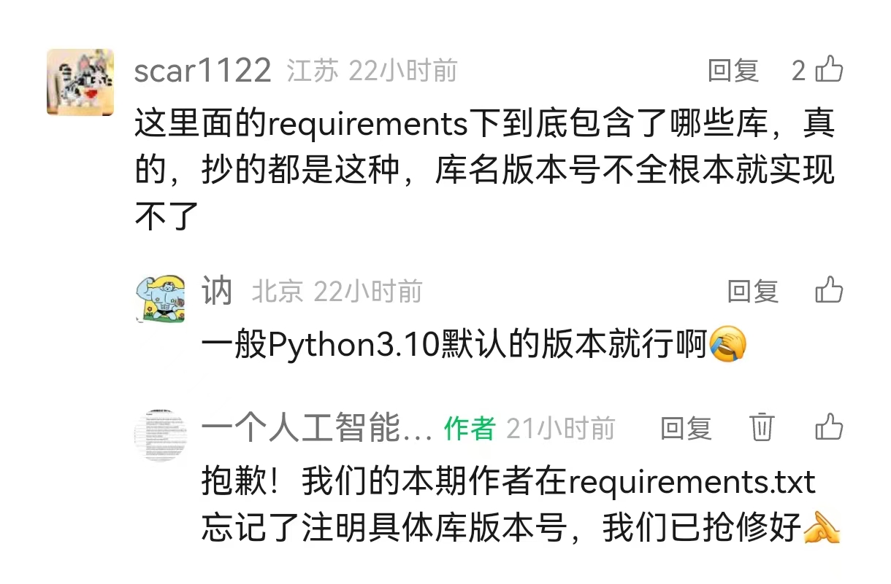

# Original Code of “一个人工智能本科生”微信公众号文章：如何用Python本地实现一个最简单的图像分析系统？(LLM+OCR)

原文链接：https://mp.weixin.qq.com/s/nU1uEjsLA115oRdgObHgaA

# 实现步骤：命令行下，按顺序执行：(本文作者使用Anaconda prompt)
0. `cd <你的项目文件夹路径>`

1. `conda create -n mcp python=3.10`

2. `conda activate mcp`

3. `pip install -r requirements.txt -i https://pypi.mirrors.ustc.edu.cn/simple/`

4. 去官网下载并安装ollama应用程序
(https://ollama.com/)

5. 命令行执行 `ollama run qwen3:1.7b`下载qwen3大模型权重

6. 验证运行纯后端
`python client.py service.py --image ./image.png --query` 帮我总结一下这张图像

7. 验证运行前端，完成本项目
`streamlit run app.py`

# 评论区说明：
10月19日的库版本号不全问题（见下图）已与10月20日早上10点修补，审稿人已亲测可复现，若还有任何问题，欢迎多多在私信或评论区留言。
